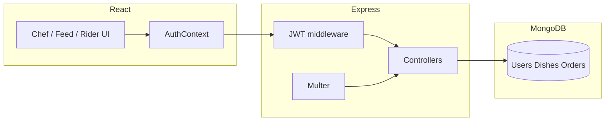

# Society HomeChef — MVP

Hyperlocal food ordering for neighborhoods and gated communities: **Chefs** list dishes, **Residents** order from their local feed, **Riders** deliver. Stack: **React (Vite) + Tailwind**, **Express + MongoDB**, **JWT**, **Multer** (local `uploads/`), heuristic **nutrition** (no external AI API).

---

## 1. System design

### Architecture

| Layer | Responsibility |
|--------|----------------|
| **React SPA** | Role-specific dashboards, JWT in `localStorage`, REST calls to API |
| **Express API** | Auth, validation, business rules, static media |
| **MongoDB** | Users, dishes, orders |
| **Uploads folder** | Images/videos served at `/uploads/*` |



### End-to-end flow

1. **Signup/Login** → JWT issued with `sub` + `role`.
2. **Chef** creates a dish (optional media); server runs **nutrition heuristic** on dish name, sets `calories`, `healthScore`, merges **tags** (Veg, High Protein, etc.).
3. **Resident** opens **feed** (filtered by exact `societyName` / Area); optional query filters (veg / high protein / low calorie).
4. **Order placed** → stock **decrement**; if qty hits 0, dish marked **sold out**; **nearest online rider** in the same area selected by **Haversine** distance to delivery coordinates; order `riderId` + `rider_assigned` or left unassigned (`placed`).
5. **Rider** toggles **online**, sees **pool** (unassigned) and **assigned** orders; **Accept** → `accepted`; **Picked up** → `picked_up`; **Delivered** → `delivered`.

---

## 2. Database schema (MongoDB)

### `User`

| Field | Notes |
|--------|--------|
| `email`, `passwordHash` | Unique email |
| `role` | `chef` \| `resident` \| `rider` |
| `name`, `societyName` | `name` acts as Chef/Restaurant name for chefs; `societyName` acts as "Area or city" to match local users |
| `location.lat`, `location.lng` | Simulated coordinates |
| `isOnline` | Rider availability |
| `chefBio` | Optional chef profile |

### `Dish`

| Field | Notes |
|--------|--------|
| `chefId`, `societyName` | Copied from chef at create time |
| `name`, `price`, `quantity` | Stock |
| `imageUrl`, `videoUrl` | Media paths |
| `published`, `soldOut` | Visibility + manual sold out |
| `tags[]` | Heuristic + optional manual |
| `calories`, `healthScore` | From heuristic |

### `Order`

| Field | Notes |
|--------|--------|
| `customerId`, `chefId`, `societyName` | MVP: one chef per order |
| `items[]` | `dishId`, `name`, `quantity`, `unitPrice` |
| `totalAmount` | Sum of line items |
| `deliveryLocation` | Lat/lng (defaults from customer) |
| `riderId` | Assigned rider or null |
| `status` | `placed` → `rider_assigned` → `accepted` → `picked_up` → `delivered` |

---

## 3. Backend APIs

Base URL: `http://localhost:5050` by default (`PORT` in `backend/.env`; Vite proxies `/api` there in dev).

### Auth (`/api/auth`)

| Method | Path | Auth | Description |
|--------|------|------|-------------|
| POST | `/signup` | — | Body: `email`, `password`, `role`, `name`, `societyName`, optional `lat`, `lng` |
| POST | `/login` | — | `email`, `password` |
| GET | `/me` | JWT | Current user |
| PATCH | `/profile` | JWT | `name`, `lat`, `lng`; chef: `societyName`, `chefBio` |

### Chef (`/api/chef`) — role `chef`

| Method | Path | Description |
|--------|------|-------------|
| POST | `/dishes` | `multipart/form-data`: `name`, `price`, `quantity`, `published`, optional `media`, optional `tags` JSON array |
| GET | `/dishes` | List own dishes |
| PATCH | `/dishes/:id` | Partial update; optional new `media` |
| GET | `/analytics` | Dish count, order count, revenue, top dishes |

### Customer (`/api/customer`) — role `resident`

| Method | Path | Description |
|--------|------|-------------|
| GET | `/feed` | Query: `veg`, `highProtein`, `lowCalorie` (`true`) |
| POST | `/orders` | `{ items: [{ dishId, quantity }], deliveryLat?, deliveryLng? }` |
| GET | `/orders` | Order history |

### Rider (`/api/rider`) — role `rider`

| Method | Path | Description |
|--------|------|-------------|
| PATCH | `/availability` | `{ isOnline?, lat?, lng? }` |
| GET | `/orders` | `{ assigned, pool }` |
| POST | `/orders/:id/accept` | Accept / claim order |
| PATCH | `/orders/:id/status` | `{ status: "picked_up" \| "delivered" }` |

### Static

- `GET /uploads/:file` — uploaded media  
- `GET /health` — liveness

---

## 4. Frontend structure

```
frontend/
  src/
    api/client.js          # fetch wrapper, token, mediaUrl
    context/AuthContext.jsx
    components/
      Navbar.jsx
      DishCard.jsx
      OrderPanel.jsx
    pages/
      Login.jsx
      Signup.jsx
      ChefDashboard.jsx
      ResidentFeed.jsx
      RiderDashboard.jsx
    App.jsx                # React Router + role guards
    main.jsx
  index.html
  vite.config.js           # @tailwindcss/vite
```

State: **Context API** for auth; page-level `useState` for lists/forms.

---

## 5. AI / nutrition logic (heuristic)

Implemented in `backend/src/utils/nutrition.js`.

- **Input:** dish **name** (string).  
- **Steps:**
  1. **Keyword rules** — e.g. “fried”, “butter”, “cream” increase fat/calories and lower health; “paneer”, “dal”, “chicken” bump protein; “salad”, “steamed” add fiber and improve score.
  2. **Calories** — base (~280 kcal) + bumps from matched rules and macro weights.
  3. **Health score (/10)** — base (~6) adjusted by fat/sugar/protein/fiber signals, clamped to `[0, 10]`.
  4. **Tags** — regex/keyword tags such as `Veg`, `Non-Veg`, `High Protein`, `Indulgent`, `Light` for filters and cards.

This is **deterministic**, **offline**, and good for demos; it is **not** a medical or lab-grade estimate.

---

## 6. Setup (local)

### Prerequisites

- Node.js 18+  
- MongoDB running locally or [MongoDB Atlas](https://www.mongodb.com/cloud/atlas) URI  

### Backend

```bash
cd backend
cp .env.example .env
# Edit .env: MONGODB_URI, JWT_SECRET, CLIENT_ORIGIN=http://localhost:5173
npm install
npm run dev
```

API: `http://localhost:5050` (port **5050** avoids Windows often reserving **5000**. Use `npm run dev:watch` in `backend` only if you want auto-restart on file saves.)

### Frontend

```bash
cd frontend
# VITE_API_URL=http://localhost:5050
npm install
npm run dev
```

App: `http://localhost:5173`

### Demo checklist

1. Sign up **chef**, **resident**, **rider** with the **exact same "Area or city" (`societyName`)** (and plausible lat/lng for matching).  
2. Chef: add a dish (e.g. “Paneer tikka”) with image; publish.  
3. Rider: set coordinates close to resident, **Go online**.  
4. Resident: open feed, place order → rider should see assignment or pool.  
5. Rider: **Accept** → **Picked up** → **Delivered**.

---

## Implementation plan (how this repo was built)

1. **Models** — User, Dish, Order with society + roles.  
2. **Auth** — bcrypt + JWT; middleware for role routes.  
3. **Nutrition util** — keyword rules + tags.  
4. **Chef routes** — Multer upload + dish CRUD + analytics aggregation.  
5. **Customer routes** — society feed + filters + place order + rider assignment (Haversine).  
6. **Rider routes** — availability + accept + status transitions.  
7. **Frontend** — Vite React, Tailwind, Router, AuthContext, three dashboards.  
8. **README** — architecture, schema, API, AI explanation.

---

## License

MIT — use freely for learning and prototypes.
